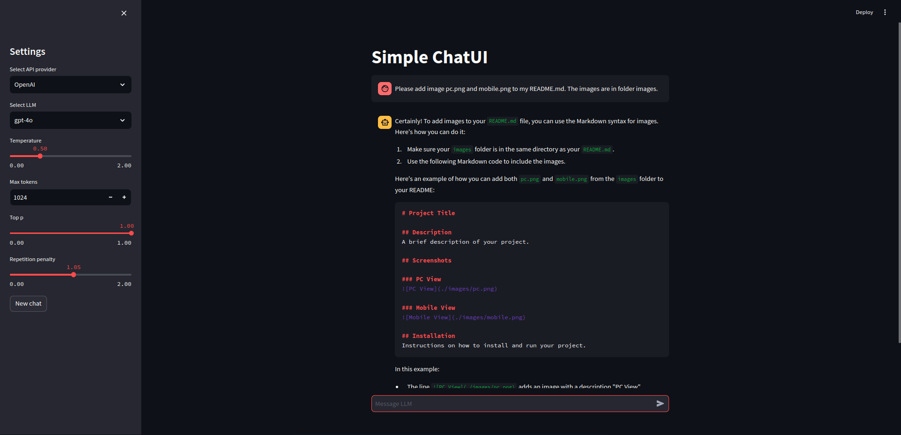
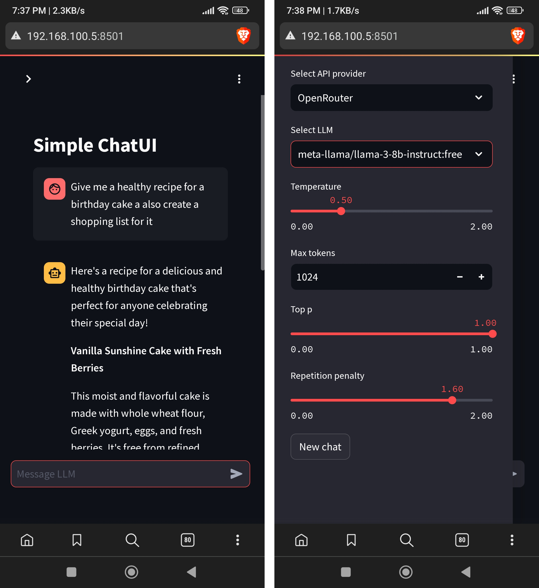

# Streamlit LLM chat app
I made this for quick testing of different OpenAI compatible APIs.
You can choose API provider, model and a few parameters like temperature, max output tokens, top p, repetition penalty.





## Setup
- Install requirements `pip install -r requirements.txt` or just download `openai` and `streamlit` with `pip install openai streamlit`
- You need to provide a `config.json` file that contains service name, API keys, base url endpoint and models you want to use.

Here is an example of it:
```json
{
    "OpenAI" : {
        "completions_endpoint": "https://api.openai.com/v1/",
        "api_key": "your openai api key",
        "models": [
            "gpt-4o",
            "gpt-4-turbo",
            "gpt-3.5-turbo"
        ]
    },
    "OpenRouter": {
        "completions_endpoint": "https://openrouter.ai/api/v1",
        "api_key": "your openrouter api key",
        "models": [
            "mistralai/mistral-7b-instruct:free",
            "meta-llama/llama-3-8b-instruct:free",
            "microsoft/phi-3-medium-128k-instruct:free"
        ]
    }
}
```

- Run it with `streamlit run ui.py`
- Go to http://localhost:8501

You can also open it remotely on your phone if you configure everything (firewall, etc) by going to host_machine_ip:8501
